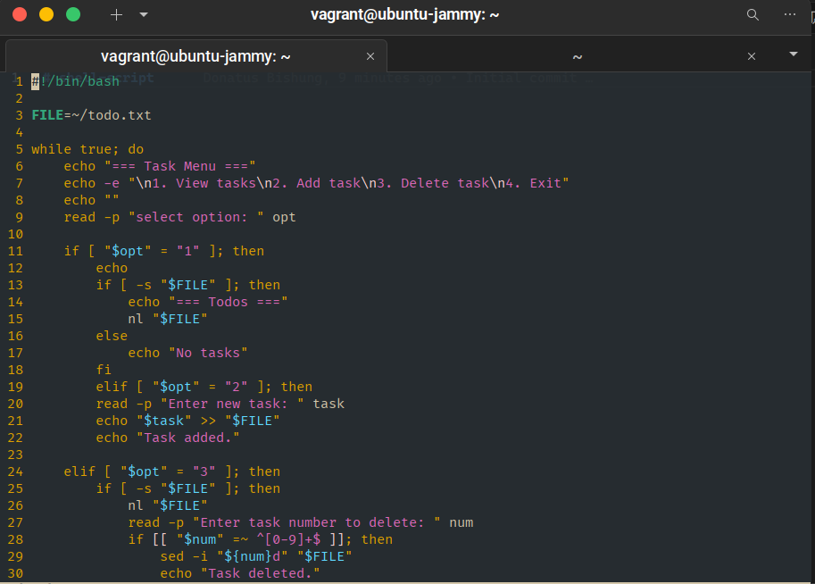
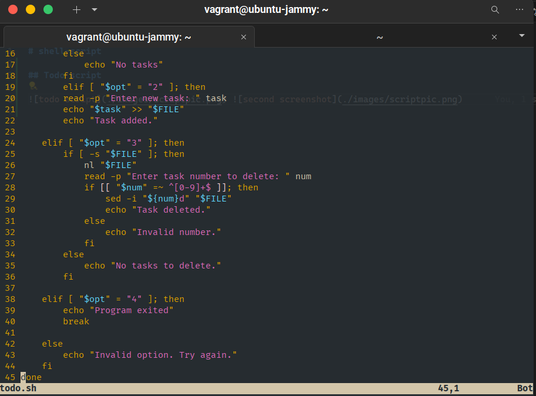
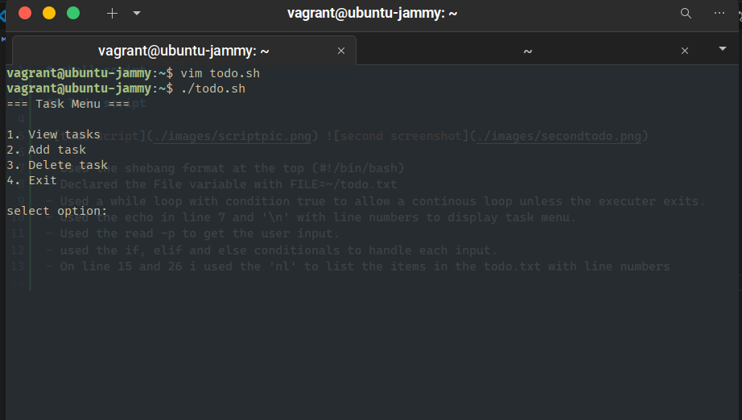
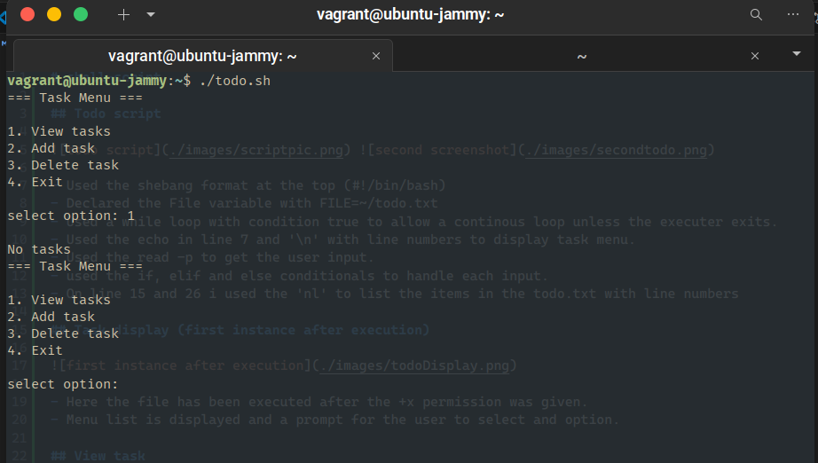
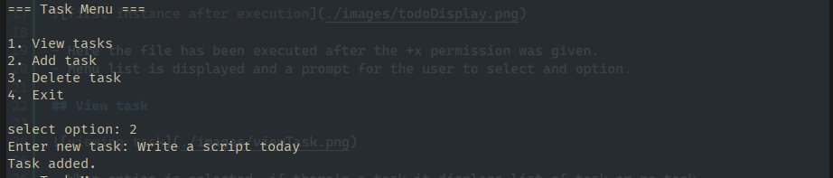
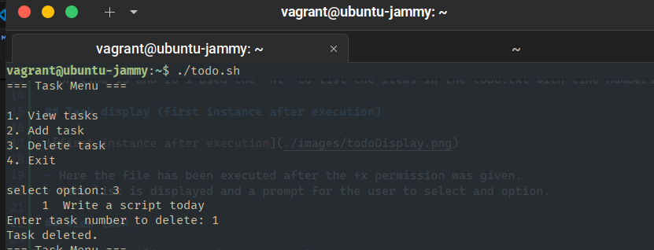

# shell-script

## Todo script

 

- Used the shebang format at the top (#!/bin/bash)
- Declared the File variable with FILE=~/todo.txt
- Used a while loop with condition true to allow a continous loop unless the executer exits.
- Used the echo in line 7 and '\n' with line numbers to display task menu.
- Used the read -p to get the user input.
- used the if, elif and else conditionals to handle each input.
- On line 15 and 26 i used the 'nl' to list the items in the todo.txt with line numbers

## Task display (first instance after execution)

- Here the file has been executed after the +x permission was given.
- Menu list is displayed and a prompt for the user to select and option.

## View task

- When option is selected, if there's a task it displace list of task or no task

## Add task

- when a task is succesfully added a message 'Task added' is displayed

## Delete task

- List of task is displayed.
- A prompt with 'Enter the task number to delete' is displayed for the user to select
